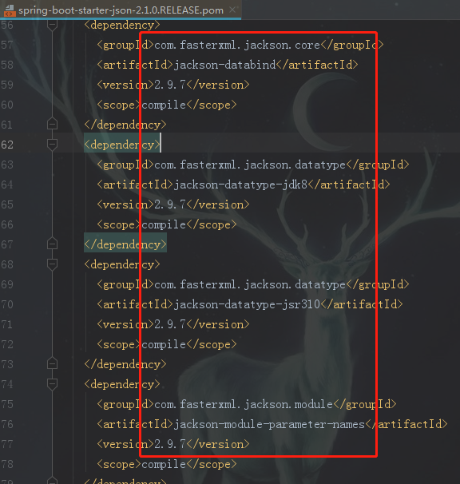

[SpringBoot系列——Jackson序列化](https://www.cnblogs.com/huanzi-qch/p/11301453.html)  
直接引入json依赖  
```xml
<!-- springboot-json -->
    <dependency>
      <groupId>org.springframework.boot</groupId>
      <artifactId>spring-boot-starter-json</artifactId>
    </dependency>
```
一般情况下我们引入MVC，MVC里面帮我们引入了JSON依赖
```xml
  <!-- springboot web(MVC)-->
        <dependency>
            <groupId>org.springframework.boot</groupId>
            <artifactId>spring-boot-starter-web</artifactId>
        </dependency>
```
